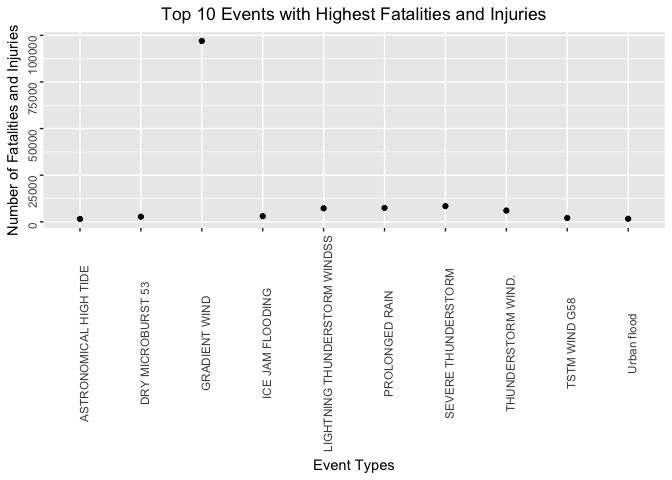

# Course Project 2: Analysis of the Impact of Storm and Severe Events on Health, Properties and Crops

#Executive Summary

This short study aims to analyse both the effects of storm and severe events on human health as well as its economic consequences. Using the data from NOAA, this study analyses the storms and severe events from 1950 to November 2011 and its effect on the population.

By analysing the impact of storms on fatalities and injuries, it is found that gradient wind, severe thunderstorm and prolonged rain are the most harmful. On the other hand, flood, river flood and hurricane/typhoon are among the major cause of property and crop damages.

Thus, the government should focus not just on helping the people to prepare for events like these if they should come, but also study these events so that the people may plan ahead and prepare in time for such natural events.

#Data Processing

##Load Required Packages


```r
library(dplyr)
library(data.table)
library(ggplot2)
```

##Download and Load Data


```r
url1 <- "https://d396qusza40orc.cloudfront.net/repdata%2Fdata%2FStormData.csv.bz2"
if(!file.exists("StormData.csv.bz2")) 
{download.file(url1, "StormData.csv.bz2")}
#read data into R
data1 <- fread(sprintf("bzcat %s | tr -d '\\000'", "StormData.csv.bz2"), stringsAsFactors = T)
```

```
## 
Read 9.3% of 967216 rows
Read 35.2% of 967216 rows
Read 54.8% of 967216 rows
Read 74.4% of 967216 rows
Read 82.7% of 967216 rows
Read 902297 rows and 37 (of 37) columns from 0.523 GB file in 00:00:08
```

```r
#detect NAs
sum(complete.cases(data1))
```

```
## [1] 0
```

Since the sum is zero, no NAs exist in the dataset.

#Results

##Most Harmful Event Types

###Combine FATALITIES and INJURIES For Two-Way Comparison


```r
data1[, fat.inj := FATALITIES + INJURIES]
```

Combining these two will give an idea of the aggregate effects on human health.

###Sum FATALITIES, INJURIES and fat.inj By Different Events


```r
#sum fatalities of different evtype
fatal <- data.frame(tapply(data1$FATALITIES, data1$EVTYPE, sum))
fatal1 <- cbind(unique(data1$EVTYPE), fatal)
colnames(fatal1) <- make.names(c("evtype", "fat.num"))
#sum injuries of different evtype
injur <- data.frame(tapply(data1$INJURIES, data1$EVTYPE, sum))
injur1 <- cbind(unique(data1$EVTYPE), injur)
colnames(injur1) <- make.names(c("evtype", "injur.num"))
#sum combination of injuries and fatalities by evtype
tot.fat.inj <- data.frame(tapply(data1$fat.inj, data1$EVTYPE, sum))
tot.fat.inj1 <- cbind(unique(data1$EVTYPE), tot.fat.inj)
colnames(tot.fat.inj1) <- make.names(c("evtype", "fat.inj.num"))
```

###Top Ten Most Harmful Events


```r
#arrange fatal1 and injur1 by sum
fatal1 <- fatal1 %>%
  arrange(desc(fat.num))
injur1 <- injur1 %>%
  arrange(desc(injur.num))
tot.fat.inj1 <- tot.fat.inj1 %>%
  arrange(desc(fat.inj.num))
#show top ten most fatal evtype
head(fatal1, n = 10)
```

```
##                            evtype fat.num
## 1                   GRADIENT WIND    5633
## 2             SEVERE THUNDERSTORM    1903
## 3               DRY MICROBURST 53     978
## 4                ICE JAM FLOODING     937
## 5              THUNDERSTORM WIND.     816
## 6                  PROLONGED RAIN     504
## 7   LIGHTNING THUNDERSTORM WINDSS     470
## 8                      WINTER MIX     368
## 9  THUNDERSTORM WINDS      LE CEN     248
## 10              THUNDERSTORM WINS     224
```

```r
#show top ten evtype with most injuries
head(injur1, n = 10)
```

```
##                           evtype injur.num
## 1                  GRADIENT WIND     91346
## 2                 PROLONGED RAIN      6957
## 3  LIGHTNING THUNDERSTORM WINDSS      6789
## 4            SEVERE THUNDERSTORM      6525
## 5             THUNDERSTORM WIND.      5230
## 6               ICE JAM FLOODING      2100
## 7                  TSTM WIND G58      1975
## 8              DRY MICROBURST 53      1777
## 9                    Urban flood      1488
## 10      SNOW/SLEET/FREEZING RAIN      1361
```

```r
#show top ten evtype with most combined fatalities and injuries
head(tot.fat.inj1, n = 10)
```

```
##                           evtype fat.inj.num
## 1                  GRADIENT WIND       96979
## 2            SEVERE THUNDERSTORM        8428
## 3                 PROLONGED RAIN        7461
## 4  LIGHTNING THUNDERSTORM WINDSS        7259
## 5             THUNDERSTORM WIND.        6046
## 6               ICE JAM FLOODING        3037
## 7              DRY MICROBURST 53        2755
## 8                  TSTM WIND G58        2064
## 9                    Urban flood        1621
## 10        ASTRONOMICAL HIGH TIDE        1527
```

```r
#plot results
ggplot(data = tot.fat.inj1[1:10, ], aes(evtype, fat.inj.num)) +
  geom_point() +
  theme(axis.text = element_text(angle = 90)) + 
  labs(title = "Top 10 Events with Highest Fatalities and Injuries", 
       x = "Event Types", 
       y = "Number of Fatalities and Injuries") +
  theme(plot.title = element_text(hjust = 0.5))
```

<!-- -->

After combining fatalities and injuries, it is interesting to note that gradient wind causes the most harm to the population. Along with it, severe thunderstorm, prolonged rain and lightning thunderstorm winds are also among the most harmful events. 

##Most Costly Events

###In Terms of Property Damage


```r
#remove ? from property damage expenses
data2 <- data1[!data1$PROPDMGEXP == "?"]
#isolate property damages in billions
b <- data2 %>%
  filter(PROPDMGEXP == "B") %>%
  arrange(desc(PROPDMG)) %>%
  select(EVTYPE, PROPDMG)
head(b, n = 10)
```

```
##               EVTYPE PROPDMG
## 1              FLOOD  115.00
## 2        STORM SURGE   31.30
## 3  HURRICANE/TYPHOON   16.93
## 4        STORM SURGE   11.26
## 5  HURRICANE/TYPHOON   10.00
## 6  HURRICANE/TYPHOON    7.35
## 7  HURRICANE/TYPHOON    5.88
## 8  HURRICANE/TYPHOON    5.42
## 9     TROPICAL STORM    5.15
## 10      WINTER STORM    5.00
```

###In Terms of Crop Damages


```r
#remove ? from crop damage expenses
data3 <- data1[!data1$CROPDMGEXP == "?"]
#isolate crop damages in billions
b1 <- data3 %>%
  filter(CROPDMGEXP == "B") %>%
  arrange(desc(CROPDMG)) %>%
  select(EVTYPE, PROPDMG)
#show top three crop damaging events
head(b1, n = 3)
```

```
##              EVTYPE PROPDMG
## 1       RIVER FLOOD    5.00
## 2         ICE STORM  500.00
## 3 HURRICANE/TYPHOON    5.88
```

As for events with the largest economic impact, it appears that floods and hurricane/typhoon are most likely to cause the most losses.
